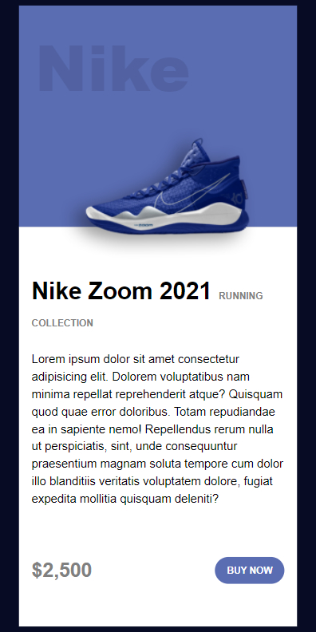
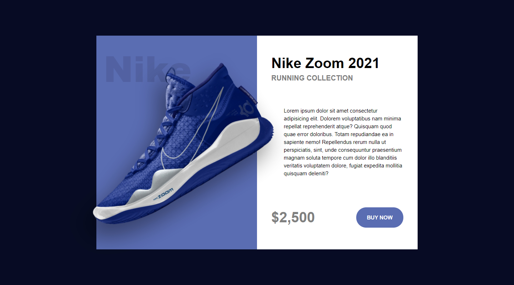

# **Componentes web Nativos** 🚀

Primer proyecto utilizando componentes web con JavaScript vanila, html y css.

## **Demo** 🔍

[_Ver el sitio aquí_](https://mooenz.github.io/componente-web-articulo/)

## **Previsualización** 👀

### **Mobile**

### **Desktop**

## **Contacto** 📞

- Linkedin [Mooenz](https://www.linkedin.com/in/mooenz/)
- Web Site [Curriculum Vitae](https://mooenz.github.io/curriculum-vitae/)

## **Licencia** 🛸

This project is [MIT](https://github.com/Mooenz/componente-web-articulo/blob/main/LICENSE) licensed.
